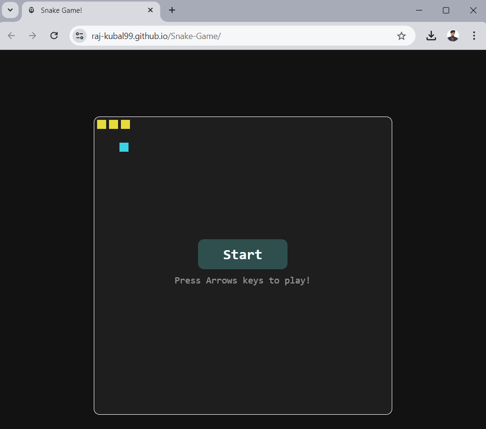
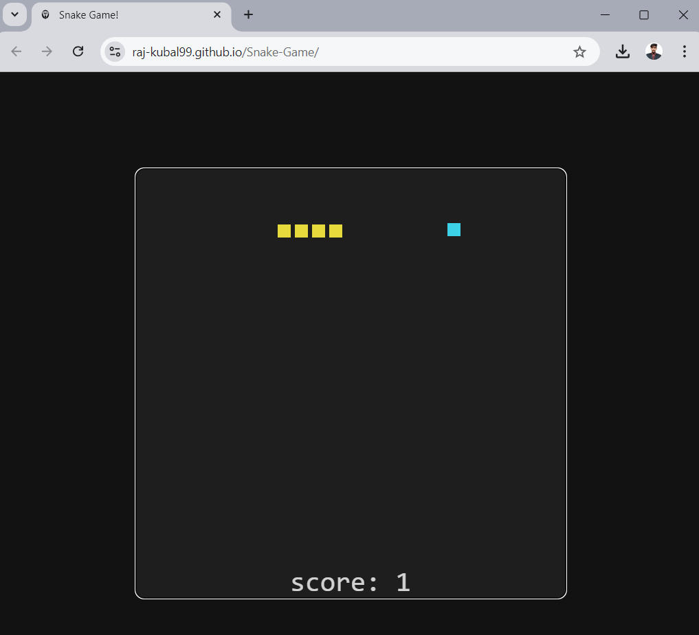
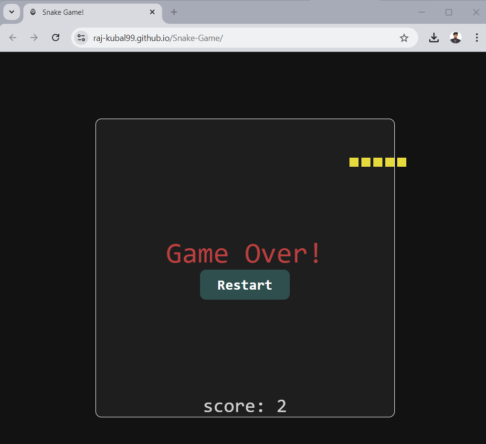

# Snake Game React App

This project is a proof of concept (POC) showcasing my hands-on experience with the fundamentals of CSS, JavaScript, React, and custom hooks. The Snake Game is a classic arcade game implemented using modern web technologies, demonstrating my ability to create interactive and responsive user interfaces.

## Live Demo

You can play the Snake Game live at [https://raj-kubal99.github.io/Snake-Game/](https://raj-kubal99.github.io/Snake-Game/).

## Features

- **Interactive Gameplay**: Navigate the snake using arrow keys and collect food to grow.
- **Responsive Design**: The game adjusts seamlessly across various screen sizes.
- **Game Over Logic**: Implemented logic to handle collisions and restart the game.
- **Dynamic Scoring**: The score increases as the snake eats food.

## Technologies Used

- **React**: A JavaScript library for building user interfaces, allowing for component-based architecture and state management.
- **JavaScript**: Core programming language used to handle game logic and interactivity.
- **CSS**: For styling the game components and ensuring a visually appealing interface.
- **GitHub Actions**: Automated deployment process to host the application on GitHub Pages.

## Project Structure
```
/Snake-Game 
├── /public 
│ └── index.html 
├── /src 
│ ├── /components 
│ │ ├── Food.js 
│ │ └── Snake.js 
│ ├── App.js 
│ ├── App.css 
│ └── index.js 
└── README.md
```

## Installation

To run the project locally, follow these steps:

1. Clone the repository:
   ```bash
   git clone https://github.com/raj-kubal99/Snake-Game.git
   cd Snake-Game

2. Install the dependencies:
   ```bash
   npm install

3. Start the development server:
   ```bash
   npm start

## How to Play

-Use the arrow keys to control the snake.
-Collect the food to grow your snake and increase your score.
-Avoid hitting the walls or the snake's own body.

## Screenshots




## Future Improvements
- Add sound effects and animations to enhance the gaming experience.
- Implement a leaderboard to track high scores.
- Optimize the game for mobile devices with touch controls.

## Acknowledgments
Special thanks to the open-source community for providing resources and inspiration throughout the development process.
